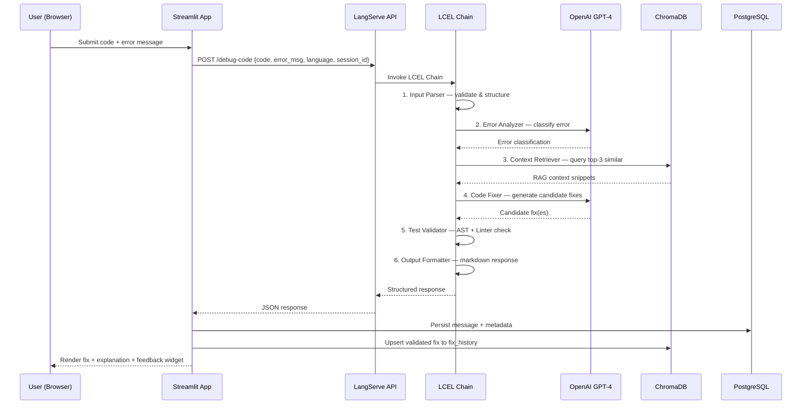

# Code Debugger Assistant — System Architecture

## High-Level Architecture

```
┌──────────────────────────────────────────────────────────────────────────────┐
│                          USER INTERFACE LAYER                                │
│                                                                              │
│   ┌──────────────────────────────────────────────────────────────────────┐   │
│   │                    Streamlit Web App (:8501)                          │   │
│   │  ┌─────────────┐  ┌──────────────────┐  ┌───────────────────────┐   │   │
│   │  │  Session     │  │  Chat Message    │  │  Code Input Area     │   │   │
│   │  │  Sidebar     │  │  Stream Panel    │  │  + Language Selector │   │   │
│   │  └─────────────┘  └──────────────────┘  └───────────────────────┘   │   │
│   └──────────────────────────────────────────────────────────────────────┘   │
└────────────────────────────────────┬─────────────────────────────────────────┘
                                     │  HTTP / REST
                                     ▼
┌──────────────────────────────────────────────────────────────────────────────┐
│                         API GATEWAY LAYER                                    │
│                                                                              │
│   ┌──────────────────────────────────────────────────────────────────────┐   │
│   │               LangServe + FastAPI Gateway (:8100)                    │   │
│   │                                                                      │   │
│   │   POST /debug-code    POST /analyze-error                            │   │
│   │   GET  /fix-suggestions   POST /validate-fix                         │   │
│   └──────────────────────────────────────────────────────────────────────┘   │
└────────────────────────────────────┬─────────────────────────────────────────┘
                                     │
                                     ▼
┌──────────────────────────────────────────────────────────────────────────────┐
│                       ORCHESTRATION LAYER                                    │
│                                                                              │
│   ┌──────────────────────────────────────────────────────────────────────┐   │
│   │                   LCEL Chain Pipeline                                 │   │
│   │                                                                      │   │
│   │   Input Parser ──► Error Analyzer ──► Context Retriever              │   │
│   │        │                                      │                      │   │
│   │        ▼                                      ▼                      │   │
│   │   Code Fixer ──────► Test Validator ──► Output Formatter             │   │
│   └──────────────────────────────────────────────────────────────────────┘   │
└──────────────────┬──────────────────────┬────────────────────────────────────┘
                   │                      │
                   ▼                      ▼
┌──────────────────────────────┐  ┌────────────────────────────────────────────┐
│    INTELLIGENCE LAYER        │  │         TOOL LAYER                         │
│                              │  │                                            │
│  ┌────────────────────────┐  │  │  ┌──────────┐  ┌──────────┐  ┌─────────┐ │
│  │   OpenAI GPT-4 (LLM)  │  │  │  │AST Parser│  │  Linter  │  │Formatter│ │
│  └────────────────────────┘  │  │  │(ast/acorn)│  │(Pylint/  │  │(Black/  │ │
│                              │  │  │          │  │ ESLint)  │  │Prettier)│ │
│  ┌────────────────────────┐  │  │  └──────────┘  └──────────┘  └─────────┘ │
│  │   LangSmith Tracing    │  │  │                                            │
│  └────────────────────────┘  │  │  ┌──────────────────┐  ┌───────────────┐  │
│                              │  │  │ Syntax Validator  │  │  Dependency   │  │
└──────────────────────────────┘  │  │                  │  │  Analyzer     │  │
                                  │  └──────────────────┘  └───────────────┘  │
                                  └────────────────────────────────────────────┘
                   │
                   ▼
┌──────────────────────────────────────────────────────────────────────────────┐
│                    PERSISTENCE & MEMORY LAYER                                │
│                                                                              │
│   ┌──────────────────────────┐    ┌──────────────────────────────────────┐   │
│   │   PostgreSQL (:5432)     │    │       ChromaDB (:8080)               │   │
│   │                          │    │                                      │   │
│   │   • sessions             │    │   • code_snippets (collection)       │   │
│   │   • messages             │    │   • error_patterns (collection)      │   │
│   │   • feedback             │    │   • fix_history (collection)         │   │
│   │   • error_classifications│    │                                      │   │
│   └──────────────────────────┘    └──────────────────────────────────────┘   │
└──────────────────────────────────────────────────────────────────────────────┘
```

---

## Layer Descriptions

### 1. User Interface Layer — Streamlit

The Streamlit app (`streamlit_app.py`) serves as the single-page front-end. It provides:

- **Session Sidebar** — Lists all previous sessions from PostgreSQL; allows creating new sessions or resuming old ones.
- **Chat Message Panel** — Renders the conversation stream with syntax-highlighted code blocks (`st.code()`), collapsible explanation sections (`st.expander()`), and feedback widgets.
- **Code Input Area** — Multi-line text input with a language selector dropdown and an optional error message field.
- **Metrics Widget** — Displays token usage and response latency per turn (sourced from LangSmith metadata).

### 2. API Gateway Layer — LangServe + FastAPI

FastAPI serves as the HTTP gateway. LangServe wraps the LCEL chains and exposes them as versioned REST endpoints:

| Endpoint | Purpose |
|---|---|
| `POST /debug-code` | Full debugging pipeline — submit code + error, receive fix |
| `POST /analyze-error` | Error classification only (lightweight) |
| `GET /fix-suggestions` | Retrieve cached / ranked suggestions for a given error |
| `POST /validate-fix` | Run AST + Linter validation on a proposed fix |

CORS is enabled for the Streamlit origin. All endpoints accept and return JSON.

### 3. Orchestration Layer — LCEL Chain Pipeline

The core logic is orchestrated as a LangChain LCEL chain (`|` pipe composition):

```
Input Parser | Error Analyzer | Context Retriever | Code Fixer | Test Validator | Output Formatter
```

Each stage is a `RunnableLambda` or `RunnablePassthrough` composing prompt templates, LLM calls, tool invocations, and output parsers. The chain is registered via `add_routes()` in LangServe.

### 4. Intelligence Layer — LLM + Agents

- **LLM Router** — OpenAI GPT-4 (`gpt-4o`) via `ChatOpenAI` from `langchain_openai`.
- **Agent System** — Seven agents (Input Validator, Error Classifier, Context Gatherer, Fix Generator, Solution Ranker, Explanation Builder, Feedback Processor) operate as functional stages within the chain.
- **LangSmith** — Every chain invocation is traced with custom tags (`error_type`, `language`, `session_id`).

### 5. Persistence & Memory Layer

- **PostgreSQL** — Stores `sessions`, `messages`, `feedback`, and `error_classifications`. Provides session resume capability.
- **ChromaDB** — Three vector collections (`code_snippets`, `error_patterns`, `fix_history`) enable RAG context retrieval. Embeddings are generated via OpenAI `text-embedding-3-small`.

---

## Data Flow — Primary Debug Request



---

## Directory Structure

```
code-debugger-assistant-extended/
├── docs/                          # Project documentation
│   ├── PRD.md                     # Product Requirements Document
│   ├── architecture.md            # This document
│   ├── api-spec.md                # API endpoint specification
│   ├── database-schema.md         # PostgreSQL + ChromaDB schema
│   └── milestones.md              # Development milestones
├── app/
│   ├── __init__.py
│   ├── server.py                  # FastAPI + LangServe entrypoint
│   ├── streamlit_app.py           # Streamlit chat UI
│   ├── config.py                  # Configuration & env management
│   ├── chains/                    # LCEL chain pipeline modules
│   │   ├── __init__.py
│   │   ├── input_parser.py        # Stage 1: Input Parser
│   │   ├── error_analyzer.py      # Stage 2: Error Analyzer
│   │   ├── context_retriever.py   # Stage 3: Context Retriever (RAG)
│   │   ├── code_fixer.py          # Stage 4: Code Fixer
│   │   ├── test_validator.py      # Stage 5: Test Validator
│   │   ├── output_formatter.py    # Stage 6: Output Formatter
│   │   └── debug_chain.py         # Composed end-to-end chain
│   ├── agents/                    # Agent system modules
│   │   ├── __init__.py
│   │   ├── input_validator.py     # FR-AG-01
│   │   ├── error_classifier.py    # FR-AG-02
│   │   ├── context_gatherer.py    # FR-AG-03
│   │   ├── fix_generator.py       # FR-AG-04
│   │   ├── solution_ranker.py     # FR-AG-05
│   │   ├── explanation_builder.py # FR-AG-06
│   │   └── feedback_processor.py  # FR-AG-07
│   ├── tools/                     # Tool integrations
│   │   ├── __init__.py
│   │   ├── ast_parser.py          # FR-TL-01
│   │   ├── syntax_validator.py    # FR-TL-02
│   │   ├── linter.py              # FR-TL-03
│   │   ├── formatter.py           # FR-TL-04
│   │   └── dependency_analyzer.py # FR-TL-05
│   └── db/                        # Database layer
│       ├── __init__.py
│       ├── postgres.py            # PostgreSQL models & queries
│       ├── chromadb_client.py     # ChromaDB collection management
│       └── models.py              # SQLAlchemy / Pydantic models
├── tests/
│   ├── __init__.py
│   ├── test_chains/
│   ├── test_agents/
│   ├── test_tools/
│   └── test_db/
├── scripts/
│   ├── init_db.py                 # PostgreSQL schema initialisation
│   ├── seed_chromadb.py           # Seed ChromaDB with sample data
│   └── run_dev.sh                 # Start all services locally
├── docker-compose.yml
├── Dockerfile.api
├── Dockerfile.streamlit
├── .env.example
├── requirements.txt
├── pyproject.toml
├── README.md
└── .gitignore
```

---

*Code Debugger Assistant — Architecture v1.0*
