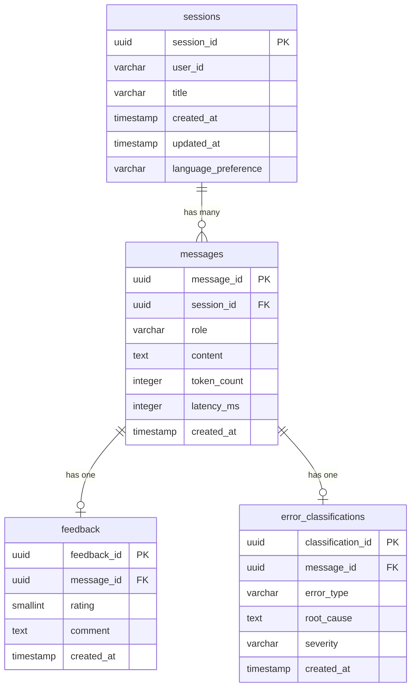

# Code Debugger Assistant — Database Schema

## PostgreSQL Schema

### Entity Relationship Diagram



---

### Table Definitions

#### `sessions`

Stores debugging sessions. Each session is a continuous multi-turn conversation.

```sql
CREATE TABLE sessions (
    session_id      UUID PRIMARY KEY DEFAULT gen_random_uuid(),
    user_id         VARCHAR(255) DEFAULT 'anonymous',
    title           VARCHAR(500),
    created_at      TIMESTAMP WITH TIME ZONE DEFAULT NOW(),
    updated_at      TIMESTAMP WITH TIME ZONE DEFAULT NOW(),
    language_preference VARCHAR(50) DEFAULT 'python'
);

CREATE INDEX idx_sessions_user_id ON sessions(user_id);
CREATE INDEX idx_sessions_created_at ON sessions(created_at DESC);
```

| Column | Type | Constraints | Description |
|---|---|---|---|
| `session_id` | UUID | PK, auto-generated | Unique session identifier |
| `user_id` | VARCHAR(255) | Default `'anonymous'` | User identity (future multi-user support) |
| `title` | VARCHAR(500) | Nullable | Auto-generated from first message or user-set |
| `created_at` | TIMESTAMPTZ | Default `NOW()` | Session creation time |
| `updated_at` | TIMESTAMPTZ | Default `NOW()` | Last activity time |
| `language_preference` | VARCHAR(50) | Default `'python'` | Preferred programming language |

---

#### `messages`

Individual conversation turns within a session.

```sql
CREATE TABLE messages (
    message_id      UUID PRIMARY KEY DEFAULT gen_random_uuid(),
    session_id      UUID NOT NULL REFERENCES sessions(session_id) ON DELETE CASCADE,
    role            VARCHAR(20) NOT NULL CHECK (role IN ('user', 'assistant')),
    content         TEXT NOT NULL,
    token_count     INTEGER DEFAULT 0,
    latency_ms      INTEGER,
    created_at      TIMESTAMP WITH TIME ZONE DEFAULT NOW()
);

CREATE INDEX idx_messages_session_id ON messages(session_id);
CREATE INDEX idx_messages_created_at ON messages(created_at);
```

| Column | Type | Constraints | Description |
|---|---|---|---|
| `message_id` | UUID | PK, auto-generated | Unique message identifier |
| `session_id` | UUID | FK → `sessions`, NOT NULL, CASCADE | Parent session |
| `role` | VARCHAR(20) | NOT NULL, CHECK | `'user'` or `'assistant'` |
| `content` | TEXT | NOT NULL | Message body (code, markdown, etc.) |
| `token_count` | INTEGER | Default 0 | Total tokens used for this turn |
| `latency_ms` | INTEGER | Nullable | Response generation latency (assistant only) |
| `created_at` | TIMESTAMPTZ | Default `NOW()` | Message timestamp |

---

#### `feedback`

User feedback on assistant responses (thumbs up/down).

```sql
CREATE TABLE feedback (
    feedback_id     UUID PRIMARY KEY DEFAULT gen_random_uuid(),
    message_id      UUID NOT NULL REFERENCES messages(message_id) ON DELETE CASCADE,
    rating          SMALLINT NOT NULL CHECK (rating BETWEEN 1 AND 5),
    comment         TEXT,
    created_at      TIMESTAMP WITH TIME ZONE DEFAULT NOW()
);

CREATE INDEX idx_feedback_message_id ON feedback(message_id);
CREATE INDEX idx_feedback_rating ON feedback(rating);
```

| Column | Type | Constraints | Description |
|---|---|---|---|
| `feedback_id` | UUID | PK, auto-generated | Unique feedback identifier |
| `message_id` | UUID | FK → `messages`, NOT NULL, CASCADE | Rated message |
| `rating` | SMALLINT | NOT NULL, 1–5 | 1 = thumbs down, 5 = thumbs up |
| `comment` | TEXT | Nullable | Optional free-text comment |
| `created_at` | TIMESTAMPTZ | Default `NOW()` | Feedback submission time |

---

#### `error_classifications`

Structured error analysis results.

```sql
CREATE TABLE error_classifications (
    classification_id   UUID PRIMARY KEY DEFAULT gen_random_uuid(),
    message_id          UUID NOT NULL REFERENCES messages(message_id) ON DELETE CASCADE,
    error_type          VARCHAR(100) NOT NULL,
    root_cause          TEXT,
    severity            VARCHAR(20) CHECK (severity IN ('low', 'medium', 'high', 'critical')),
    created_at          TIMESTAMP WITH TIME ZONE DEFAULT NOW()
);

CREATE INDEX idx_error_class_message_id ON error_classifications(message_id);
CREATE INDEX idx_error_class_error_type ON error_classifications(error_type);
```

| Column | Type | Constraints | Description |
|---|---|---|---|
| `classification_id` | UUID | PK, auto-generated | Unique classification identifier |
| `message_id` | UUID | FK → `messages`, NOT NULL, CASCADE | Associated message |
| `error_type` | VARCHAR(100) | NOT NULL | SyntaxError, RuntimeError, LogicError, DependencyError, TypeMismatch, Other |
| `root_cause` | TEXT | Nullable | Root cause description |
| `severity` | VARCHAR(20) | CHECK | low, medium, high, critical |
| `created_at` | TIMESTAMPTZ | Default `NOW()` | Classification time |

---

### Initialisation Script

The full initialisation script is in `scripts/init_db.py`. It creates all tables, indexes, and inserts default seed data.

---

## ChromaDB Collections

ChromaDB is used as the vector store for RAG (Retrieval-Augmented Generation). Three collections are maintained:

### Collection: `code_snippets`

Stores code blocks with metadata for context retrieval during debugging.

| Field | Type | Description |
|---|---|---|
| `id` | string | Unique snippet ID |
| `document` | string | Code block content |
| `embedding` | float[] | OpenAI `text-embedding-3-small` vector |
| `metadata.language` | string | Programming language |
| `metadata.source` | string | Origin (user_submitted, seed_data, validated_fix) |
| `metadata.session_id` | string | Source session (nullable) |
| `metadata.created_at` | string | ISO 8601 timestamp |

### Collection: `error_patterns`

Stores error messages and stack traces for similarity matching.

| Field | Type | Description |
|---|---|---|
| `id` | string | Unique pattern ID |
| `document` | string | Error message + stack trace |
| `embedding` | float[] | OpenAI `text-embedding-3-small` vector |
| `metadata.error_type` | string | Classified error type |
| `metadata.language` | string | Programming language |
| `metadata.severity` | string | Error severity |
| `metadata.resolution` | string | Brief fix summary (nullable) |
| `metadata.created_at` | string | ISO 8601 timestamp |

### Collection: `fix_history`

Stores validated fixes for solution ranking and RAG retrieval.

| Field | Type | Description |
|---|---|---|
| `id` | string | Unique fix ID |
| `document` | string | Fixed code block + explanation |
| `embedding` | float[] | OpenAI `text-embedding-3-small` vector |
| `metadata.language` | string | Programming language |
| `metadata.error_type` | string | Original error type |
| `metadata.ast_valid` | boolean | AST validation passed |
| `metadata.lint_status` | string | pass / fail |
| `metadata.user_rating` | integer | User feedback rating (nullable) |
| `metadata.created_at` | string | ISO 8601 timestamp |

### Embedding Model

All ChromaDB embeddings use OpenAI `text-embedding-3-small` (1536 dimensions) via `langchain_openai.OpenAIEmbeddings`.

### Distance Function

Cosine similarity (ChromaDB default) is used for all similarity queries.

---

*Code Debugger Assistant — Database Schema v1.0*
