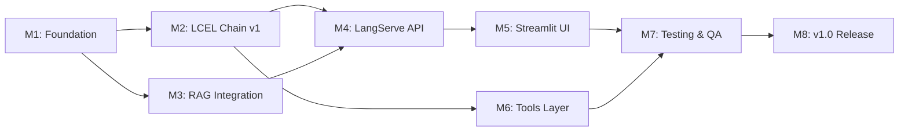

# Code Debugger Assistant — Development Milestones

## Timeline Overview

```
Week 1     Week 2     Week 3     Week 4     Week 5     Week 6     Week 7     Week 8
  M1         M2         M3         M4         M5         M6         M7         M8
  ├──────────┼──────────┼──────────┼──────────┼──────────┼──────────┼──────────┤
  Foundation  LCEL v1    RAG        API        UI         Tools      Testing    Release
```

---

## M1 — Foundation (Week 1)

**Goal:** Set up the project scaffold, infrastructure, and persistence layer.

### Deliverables

| # | Task | Status |
|---|---|---|
| 1.1 | Project directory structure (`app/`, `tests/`, `scripts/`, `docs/`) | Pending |
| 1.2 | `pyproject.toml` / `requirements.txt` with all dependencies | Pending |
| 1.3 | `docker-compose.yml` — Streamlit, FastAPI, PostgreSQL, ChromaDB services | Pending |
| 1.4 | `Dockerfile.api` and `Dockerfile.streamlit` | Pending |
| 1.5 | `.env.example` with all required environment variables | Pending |
| 1.6 | PostgreSQL schema initialisation script (`scripts/init_db.py`) | Pending |
| 1.7 | ChromaDB collection initialisation (`scripts/seed_chromadb.py`) | Pending |
| 1.8 | `app/config.py` — Centralised configuration management | Pending |
| 1.9 | `app/db/postgres.py` — SQLAlchemy models & connection pool | Pending |
| 1.10 | `app/db/chromadb_client.py` — ChromaDB client wrapper | Pending |
| 1.11 | Basic FastAPI health check endpoint (`GET /health`) | Pending |
| 1.12 | `.gitignore` and `README.md` | Pending |

### Exit Criteria

- `docker-compose up` starts all 4 services without errors.
- `GET /health` returns `{"status": "healthy"}`.
- PostgreSQL tables are created and queryable.
- ChromaDB collections exist and accept test inserts.

---

## M2 — LCEL Chain v1 (Week 2)

**Goal:** Build the core LCEL debugging pipeline with GPT-4.

### Deliverables

| # | Task | Status |
|---|---|---|
| 2.1 | `app/chains/input_parser.py` — Validate and structure user input | Pending |
| 2.2 | `app/chains/error_analyzer.py` — Classify error type, severity, root cause | Pending |
| 2.3 | `app/chains/code_fixer.py` — Generate candidate fixes via GPT-4 | Pending |
| 2.4 | `app/chains/output_formatter.py` — Format response as structured markdown | Pending |
| 2.5 | `app/chains/debug_chain.py` — Compose stages into single LCEL chain | Pending |
| 2.6 | Prompt templates for each stage | Pending |
| 2.7 | Pydantic request/response models (`app/db/models.py`) | Pending |

### Exit Criteria

- End-to-end chain invocation with sample input returns a structured fix.
- Each chain stage logs correctly to console.
- Response matches the expected Pydantic schema.

---

## M3 — RAG Integration (Week 3)

**Goal:** Add ChromaDB-backed semantic retrieval to the chain pipeline.

### Deliverables

| # | Task | Status |
|---|---|---|
| 3.1 | `app/chains/context_retriever.py` — Query ChromaDB for top-k similar contexts | Pending |
| 3.2 | Embedding pipeline using `OpenAIEmbeddings` (`text-embedding-3-small`) | Pending |
| 3.3 | Seed dataset — 50+ error patterns, code snippets, and fix examples | Pending |
| 3.4 | `scripts/seed_chromadb.py` — Populate collections from seed data | Pending |
| 3.5 | Insert Context Retriever into the LCEL chain between Error Analyzer and Code Fixer | Pending |
| 3.6 | RAG context formatting — inject retrieved snippets into the Code Fixer prompt | Pending |

### Exit Criteria

- ChromaDB returns relevant context for sample error queries.
- Code Fixer output quality improves measurably with RAG context vs. without.
- Seed data is version-controlled and reproducible.

---

## M4 — LangServe API (Week 4)

**Goal:** Expose the LCEL chain via LangServe/FastAPI REST endpoints.

### Deliverables

| # | Task | Status |
|---|---|---|
| 4.1 | `POST /debug-code` — Full debugging pipeline endpoint | Pending |
| 4.2 | `POST /analyze-error` — Lightweight error classification endpoint | Pending |
| 4.3 | `GET /fix-suggestions` — Cached fix retrieval endpoint | Pending |
| 4.4 | `POST /validate-fix` — AST + Linter validation endpoint | Pending |
| 4.5 | `POST /feedback` — User feedback submission endpoint | Pending |
| 4.6 | `GET /sessions` and `GET /sessions/{id}/messages` — Session management | Pending |
| 4.7 | LangSmith tracing — Enable for all LCEL runs with custom tags | Pending |
| 4.8 | Error handling middleware — Structured error responses | Pending |
| 4.9 | CORS configuration for Streamlit origin | Pending |

### Exit Criteria

- All endpoints respond correctly to valid and invalid requests.
- LangSmith dashboard shows traced runs with custom tags.
- API documentation auto-generated at `/docs`.

---

## M5 — Streamlit UI (Week 5)

**Goal:** Build the full chat interface with session management.

### Deliverables

| # | Task | Status |
|---|---|---|
| 5.1 | `app/streamlit_app.py` — Main Streamlit application | Pending |
| 5.2 | Session sidebar — List, create, and resume sessions | Pending |
| 5.3 | Chat message stream — User and assistant message rendering | Pending |
| 5.4 | Code input area — Multi-line input with language selector | Pending |
| 5.5 | Syntax-highlighted code blocks (`st.code()`) | Pending |
| 5.6 | Collapsible explanation sections (`st.expander()`) | Pending |
| 5.7 | Thumbs up/down feedback widget per response | Pending |
| 5.8 | Copy-to-clipboard button on code blocks | Pending |
| 5.9 | Token usage and latency display (LangSmith metadata) | Pending |
| 5.10 | Error classification coloured badges | Pending |

### Exit Criteria

- Full multi-turn conversation works end-to-end in the browser.
- Sessions are resumable across page refreshes.
- Feedback is recorded and visible in PostgreSQL.

---

## M6 — Tools Layer (Week 6)

**Goal:** Integrate AST parsing, linting, formatting, and dependency analysis.

### Deliverables

| # | Task | Status |
|---|---|---|
| 6.1 | `app/tools/ast_parser.py` — Python `ast` module integration | Pending |
| 6.2 | `app/tools/syntax_validator.py` — Pre-execution syntax check | Pending |
| 6.3 | `app/tools/linter.py` — Pylint integration for Python | Pending |
| 6.4 | `app/tools/formatter.py` — Black integration for Python | Pending |
| 6.5 | `app/tools/dependency_analyzer.py` — Missing import detection | Pending |
| 6.6 | `app/chains/test_validator.py` — Integrate tools into LCEL chain | Pending |
| 6.7 | `POST /validate-fix` endpoint wired to tool outputs | Pending |

### Exit Criteria

- AST parser correctly parses valid Python and rejects invalid.
- Linter returns structured lint errors/warnings.
- Formatter applies Black formatting to all returned code blocks.
- Test Validator stage automatically validates candidate fixes.

---

## M7 — Testing & QA (Week 7)

**Goal:** Comprehensive test coverage and quality assurance.

### Deliverables

| # | Task | Status |
|---|---|---|
| 7.1 | Unit tests for each chain stage (`tests/test_chains/`) | Pending |
| 7.2 | Unit tests for each agent (`tests/test_agents/`) | Pending |
| 7.3 | Unit tests for each tool (`tests/test_tools/`) | Pending |
| 7.4 | Integration tests for database operations (`tests/test_db/`) | Pending |
| 7.5 | API endpoint integration tests | Pending |
| 7.6 | LangSmith evaluation runs — Automated correctness checks | Pending |
| 7.7 | Load testing — 50 concurrent sessions | Pending |
| 7.8 | Bug fixes from QA findings | Pending |

### Exit Criteria

- All unit tests pass with > 80% code coverage.
- API integration tests pass for all endpoints.
- P95 response time < 8 seconds under 50 concurrent sessions.
- No critical bugs in issue tracker.

---

## M8 — v1.0 Release (Week 8)

**Goal:** Production-ready release with documentation and demo.

### Deliverables

| # | Task | Status |
|---|---|---|
| 8.1 | Production Docker Compose configuration | Pending |
| 8.2 | `README.md` — Setup, usage, and configuration guide | Pending |
| 8.3 | API documentation review and cleanup | Pending |
| 8.4 | Demo walkthrough video/script | Pending |
| 8.5 | Security review — API key handling, PII redaction | Pending |
| 8.6 | Performance benchmarks documented | Pending |
| 8.7 | Release tag and changelog | Pending |

### Exit Criteria

- `docker-compose up` from a fresh clone results in a fully working system.
- README covers all setup steps end-to-end.
- Demo script successfully walks through all user flows.
- No open critical/high-severity issues.

---

## Dependency Graph



---

*Code Debugger Assistant — Milestones v1.0*
